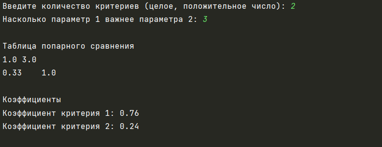
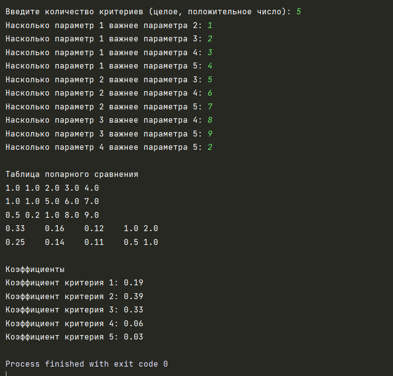

## Автор: 
Шляпникова Елена

## Задание:
 Написать на любом языке программу, реализующую метод анализа иерархий Томаса Саати для одного уровня.

## Описание:
Пользователь вводит количество критериев для анализа иерархии Томаса Саати, а также коэффициенты сравнения для этих критериев.

На основе этих данных программа строит матрицу парных сравнений и выводит весовые коэффициенты этих критериев

## Тесты:

## Инструкция:

Для использования программы необходимо выполнить следующие действия:
1) Запустить программу
2) Ввести число
3) Получить результат выполнения

## Комментарий:

Для разработки данной программы использовалась среда разработки PyCharm.
Для открытия файла исходного кода можно использовать любую среду разработки.